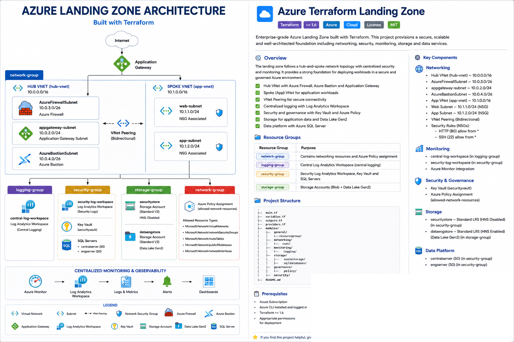

# Azure Terraform Landing Zone

A modular Azure Landing Zone built with Terraform, demonstrating networking, governance, monitoring, security, storage, and data platform services using reusable Infrastructure as Code (IaC) modules.

## Architecture



This project deploys a modular Azure Landing Zone using Terraform with dedicated networking, governance, monitoring, security, storage, and data platform components.

### Key Capabilities

- Modular Terraform architecture
- Azure virtual network segmentation
- Network Security Groups (NSGs)
- Azure Policy governance
- Azure Log Analytics workspaces
- Azure Key Vault
- Azure Storage and Data Lake Gen2
- Azure SQL environments
- Resource tagging and governance

---

## Resource Groups

| Resource Group | Purpose |
|---------------|---------|
| network-group | Networking resources |
| logging-group | Monitoring and logging |
| storage-group | Storage and data services |
| security-group | Security and governance resources |

---

## Networking

### Hub VNet

**hub-vnet** (`10.0.0.0/16`)

Reserved infrastructure subnets:

- `AzureFirewallSubnet` – `10.0.3.0/26`
- `appgateway-subnet` – `10.0.2.0/24`
- `AzureBastionSubnet` – `10.0.4.0/26`

### Application VNet

**app-vnet** (`10.1.0.0/16`)

Workload subnets:

- `web-subnet` – `10.1.1.0/24`
- `app-subnet` – `10.1.2.0/24`

Network Security Groups (NSGs) are applied to workload subnets to control inbound traffic.

Configured security rules include:

- TCP 80 (HTTP)
- TCP 22 (SSH)

---

## Monitoring

Two Log Analytics workspaces are deployed:

- `central-log-workspace`
- `security-log-workspace`

These provide centralized monitoring and operational visibility across the environment.

---

## Storage

### Security Storage

- StorageV2
- Standard LRS
- Hierarchical Namespace Disabled

### Data Engineering Storage

- StorageV2
- Standard LRS
- Hierarchical Namespace Enabled (Data Lake Gen2)

---

## Security and Governance

The landing zone includes:

- Azure Key Vault
- Azure Policy
- Network Security Groups
- Resource Tagging

Azure Policy is assigned to restrict allowed network resource types within the network resource group.

---

## Data Platform

Two Azure SQL environments are configured:

- `centralserver`
- `engserver`

Both are deployed using the S0 SKU.

---

## Terraform Module Structure

```text
modules/
├── general/
│   └── resourcegroup/
├── networking/
│   └── vnet/
├── monitoring/
│   └── logging/
├── storage/
│   ├── azurestorage/
│   └── sqldatabases/
├── security/
└── governance/
    └── policy/
```

---

## Skills Demonstrated

- Terraform Module Design
- Infrastructure as Code (IaC)
- Azure Landing Zone Architecture
- Azure Networking
- Network Segmentation
- Azure Policy Governance
- Azure Monitor & Log Analytics
- Azure Storage & Data Lake Gen2
- Azure Key Vault
- Azure SQL
- Resource Tagging and Governance

---

## Technologies Used

- Terraform
- Microsoft Azure
- Azure Virtual Network
- Azure Policy
- Azure Log Analytics
- Azure Storage Account
- Azure Data Lake Gen2
- Azure Key Vault
- Azure SQL Database